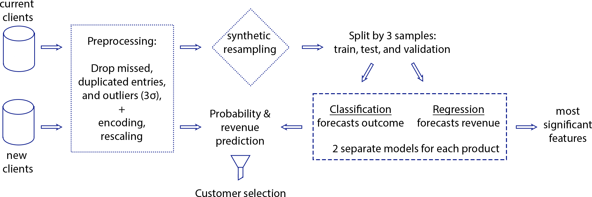
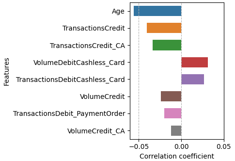

# revenue_maximization_strategy


## Content

* [Summary](README.md#Summary)  
* [Project description](README.md#Project-description)  
* [Data and methods](README.md#Data-and-methods)                                
* [Project structure](README.md#Project-structure)                   


---

## Summary
It proposed a marketing strategy aimed at revenue maximization from a direct marketing campaign. The strategy can be used as a baseline for campaign budget computation. The strategy algorithm forecasts revenues from product purchases and selects the most prospective clients in terms of purchase. It also creates the marketing persona with the most significant features for a given product. 
  

## Project description
When a company manager is planning a new marketing campaign, he is interested to do it efficiently. For instance, targeting customers with the highest propensity to the product and decreasing expenditures. In addition, he/she needs to calculate the minimum budget for the campaign. From a marketing perspective, it is interesting to identify any changes that have emerged in client propensities. To fulfill these requirements it is possible to learn from purchase history, for instance, whether a client purchased the product or service in the past. 


## Data and methods
For this assignment, the data was synthesized from a real dataset from the banking industry and covers 3 products: consumer loans, mutual funds, and credit cards. 

The strategy algorithm is based on pairs of machine learning models, which are trained on historical purchases of given products. In case the purchase rate to the number of clients is low, the algorithm synthetically increases the minority class to improve the model quality. The flow diagram below illustrates the applied algorithm.

<div align="center"> 
  </div>

<br>

<div align="center"> Fig.1 - Algorythm flow diagram</div>

<br>
Pre-trained models compute expected revenues from purchases of given products using following equation:

$${Revenue} = max \sum_{i,j=1}^{m,n}P(x_{ij})|_{purchased}*F_{i,j}$$

where:
* $P(x_{ij})|_{purchased}$ - probability that i-th customer will buy j-th product
* $F_{i,j}$ - forecasted revenue from j-th product bought by i-th customer

The mathematical model indicates that the proposed marketing strategy is conservative since it prioritizes clients by expected revenue. Therefore, it could be used as a benchmark while budgeting for a new direct marketing campaign. 

The most significant features, impacting the product purchase, could be used to compose the marketing persona as shown below.

<div align="center"> 
  </div>

<div align="center">  Fig.2 - Most significant features example </div>


## Project structure

<details>
  <summary>display project structure </summary>

```Python
revenue_maximization_strategy
├── .gitignore
├── config
│   └── config.json     # configuration settings
├── data                # data archive
│  
├── figures
│   ├── fig_1.png
.....
│   └── fig_13.png
├── models              # models and weights
│   ├── gbr_cc_opt.pkl
.....
│   └── gb_opt_mf.pkl
├── notebooks           # notebooks
│   └── Project.ipynb

├── README.md
├── requirements.txt    
└── utils               # functions and data loaders
    └── reader_config.py
```
</details>